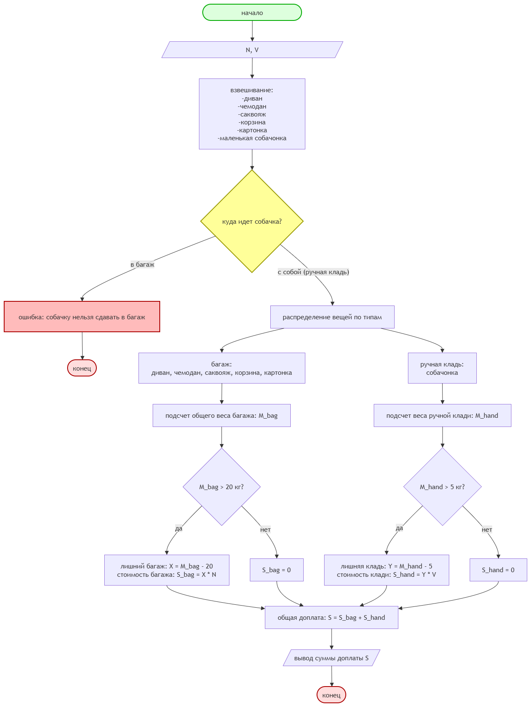

# Домашнее задание к работе 2

## Условие задачи
Дама сдавала в багаж: диван, чемодан, саквояж, корзину, картонку и маленькую собачонку. При регистрации в аэропорту каждая вещь была взвешена (вес каждой в квитанции указан). Бесплатный провоз 20 кг багажа и 5 кг ручной клади. Определить сколько придется даме доплатить за провоз вещей, если за каждый лишний 1 кг багажа нужно платить N рублей, за 1 кг ручной клади V рублей. Собачку в багажное отделение нельзя сдавать, так как там холодно.

## 1. Алгоритм и блок-схема

### Алгоритм
1. **Начало**
2. Объявить константы:
   - 'M_bag' = 20 — лимит бесплатного багажа (кг).
   - 'M_hand' = 5 — лимит бесплатной ручной клади (кг).
3. Задать исходные данные:
   - 'sofa, suitcase, trunk, basket, box' — веса вещей.
   - 'dog' — вес собачки.
   - 'N' — стоимость 1 кг перевеса багажа (руб.).
   - 'V' — стоимость 1 кг перевеса ручной клади (руб.).
4. Вычислить суммарный вес багажа (без собачки):
   - 'bagage_total' = 'sofa' + 'suitcase' + 'trunk' + 'basket' + 'box'
5. Определить лишний вес багажа:
   - Если 'bagage_total' > 'M_bag', то
   - 'X' = 'bagage_total' − 'M_bag'
Иначе
   - 'X' = 0
6. Определить лишний вес ручной клади:
Собачка считается ручной кладью.
   - Если 'dog' > 'M_hand', то
   - 'Y' = 'dog' − 'M_hand'
Иначе
   - 'Y' = 0.
7. Вычислить общую доплату:
   - 'S' = 'X' * 'N' + 'Y' * 'V'
8. Вывести результаты расчетов с подстановкой всех значений в текст.
9. **Конец**

### Блок-схема
 

 [https://drive.google.com/file/d/1yiG0vhnU-ZRHZ5Odnnhgg0rJKxmrrRSx/view?usp=sharing^]

## 2. Реализация программы

[<!-- 
#include <stdio.h>
#include <locale.h>

int main() 
{
    setlocale(LC_CTYPE, "RUS");
    int sofa = 10;      
    int suitcase = 12;  
    int trunk = 5;      
    int basket = 3;     
    int box = 4;        
    int dog = 6;        
    int N = 300;  
    int V = 400;  
    int M_bag = 20;
    int M_hand = 5;
    int bagage_total = sofa + suitcase + trunk + basket + box;
    int X = 0;
    if (bagage_total > M_bag) 
    {
        X = bagage_total - M_bag;
    }
    int Y = 0;
    if (dog > M_hand) 
    {
        Y = dog - M_hand;
    }
    int S = X * N + Y * V;

    printf("Вес багажа: %d кг\n", bagage_total);
    printf("Лишний багаж: %d кг\n", X);
    printf("Лишняя ручная кладь: %d кг\n", Y);
    printf("Доплатить всего: %d руб\n", S);

    return 0;
}
-->]

## 3. Результаты работы программы

[Вес багажа: 34 кг
Лишний багаж: 14 кг
Лишняя ручная кладь: 1 кг
Доплатить всего: 4600 руб ]

## 4. Информация о разработчике

[Теперик Карина, бОТИ-262 ]
