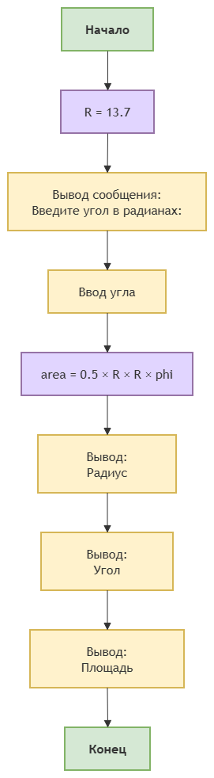

# Домашнее задание к работе 3

## Условие задачи
29. Написать и отладить программу расчета площади сектора, радиус которого равен 13.7, а дуга содержит заданное число радиан Ф.

## 1. Алгоритм и блок-схема

### Алгоритм
1. **Начало**
2. Объявить константы:
   - R = 13.7
3. Задать исходные данные:
   - 'phi';
   - 'area';
4. Вывести на экран сообщение:
   - 'Введите угол в радианах:'
5. Вычислить площадь сектора по формуле:
   - 'area' = 0.5 × R × R × phi
6. Вывести результаты расчетов с подстановкой всех значений в текст.
7. **Конец**

### Блок-схема
 

 [https://drive.google.com/file/d/1XwvRm5WPe7-GCIDcA8-ozKiMkb_V4prr/view?usp=drive_link^]

## 2. Реализация программы

[ 
#include <locale.h>
#include <stdio.h>	
#define R 13.7
int main() 
{
    setlocale(LC_CTYPE, "RUS");
    float phi;
    float area;

    printf("Введите угол в радианах: ");
    scanf("%f", &phi);

    area = 0.5 * R * R * phi;

    printf("Радиус = %.1f\n", R);
    printf("Угол = %.2f радиан\n", phi);
    printf("Площадь сектора = %.2f\n", area);

    return 0;
}
]

## 3. Результаты работы программы

[Введите угол в радианах: 1
Радиус = 13.7
Угол = 1.00 радиан
Площадь сектора = 93.85]

## 4. Информация о разработчике

[Теперик Карина, бОТИ-262 ]
