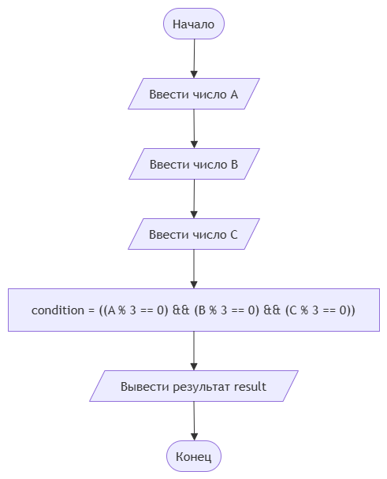

# Домашнее задание к работе 4

## Условие задачи
14. Калибровка станка
Три важнейших параметра станка (A, B, C) должны быть идеально отлажены. Система калибровки выдает сообщение об успехе, если каждое из значений параметра кратно трем. Запишите условие успешной калибровки.

## 1. Алгоритм и блок-схема

### Алгоритм
1. **Начало**
2. Задать исходные данные:
   - 'A';
   - 'B';
   - 'C';
   - 'result';
3. Вывести на экран сообщение:
   - '=== Система калибровки станка ==='
   - 'Введите целое число А:'
   - 'Введите целое число B:'
   - 'Введите целое число C:'
4. Вычислить условие:
   - 'condition' = (A % 3 == 0) && (B % 3 == 0) && (C % 3 == 0)
5. Присвоить значение:
   - 'result' = 1 - да, 0 - нет
7. Вывести на экран сообщение:
   - 'Калибровка успешна (1 — да, 0 — нет)'
9. **Конец**

### Блок-схема
 

 [^]

## 2. Реализация программы

[ 
#include <locale.h>
#include <stdio.h>	

int main() 
{
    setlocale(LC_CTYPE, "RUS");
    int A, B, C;
    int condition;

    printf("=== Система калибровки станка ===\n");
    printf("Введите целое число А: ");
    scanf("%d", &A);
    printf("Введите целое число B: ");
    scanf("%d", &B);
    printf("Введите целое число C: ");
    scanf("%d", &C);
    condition = ((A % 3 == 0) && (B % 3 == 0) && (C % 3 == 0));

    printf("Калибровка успешна (1 - да, 0 - нет): %d\n", condition);
    return 0;
}
]

## 3. Результаты работы программы

[=== Система калибровки станка ===
Введите целое число А: 3
Введите целое число B: 3
Введите целое число C: 3
Калибровка успешна (1 - да, 0 - нет): 1]

## 4. Информация о разработчике

[Теперик Карина, бОТИ-262 ]

