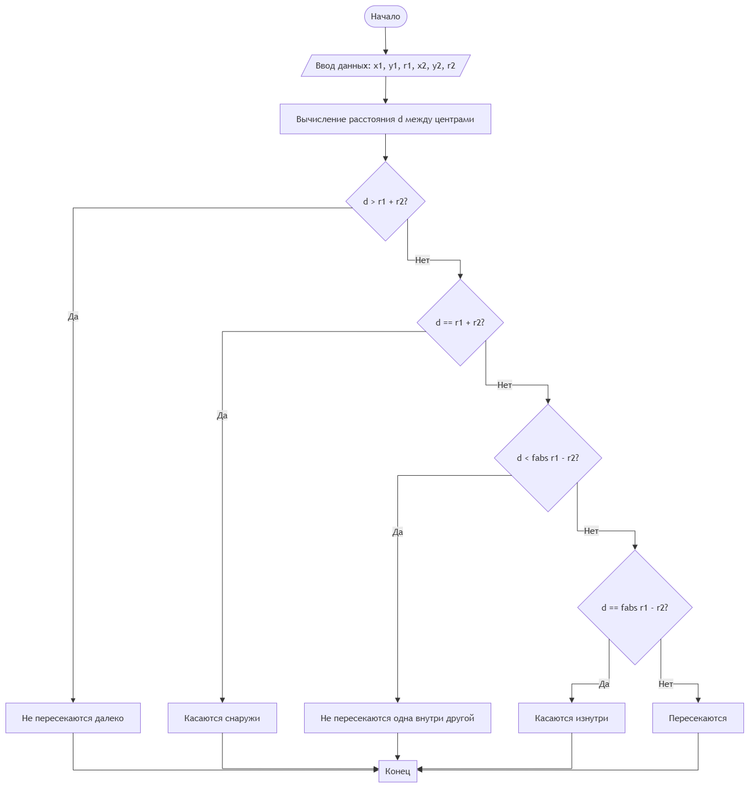

# Домашнее задание к работе 6

## Условие задачи
28.Две окружности заданы координатами своих центров и радиусами. Требуется определить, пересекаются ли они.

## 1. Алгоритм и блок-схема

### Алгоритм
1. **Начало**
2. Задать исходные данные:
   - 'x1,y1,r1';
   - 'x2,y2.r2';
   - 'd';
3. Вывести на экран сообщение:
   - 'Введите координаты центра и радиус первой окружности (x1 y1 r1): '
   - 'Введите координаты центра и радиус второй окружности (x2 y2 r2): '
4. Вычислить условие:
   - 'd' = sqrt((x2 - x1)*(x2 - x1) + (y2 - y1)*(y2 - y1))
5. Присвоить значение:
   - '(d > r1 + r2)' = 'Не пересекаются (далеко)'
   - '(d == r1 + r2)' = 'Касаются снаружи'
   - '(d < fabs(r1 - r2))' = 'Не пересекаются (одна внутри другой)'
   - '(d == fabs(r1 - r2))' = 'Касаются изнутри'
   - '(d > fabs(r1 - r2))' = 'Пересекаются'

7. Вывести на экран сообщение:
   - 'Не пересекаются (далеко)/Касаются снаружи/Не пересекаются (одна внутри другой)/Касаются изнутри/Пересекаются'
9. **Конец**

### Блок-схема
 

 [^]

## 2. Реализация программы

[ 
#include <locale.h>
#include <stdio.h>	
#include <math.h>
int main()
{
    setlocale(LC_CTYPE, "RUS");
    double x1, y1, r1;
    double x2, y2, r2;
    printf("Ââåäèòå êîîðäèíàòû öåíòðà è ðàäèóñ ïåðâîé îêðóæíîñòè(x1,y1,z1): \n");
    scanf_s("%lf %lf %lf", &x1, &y1, &r1);

    printf("Ââåäèòå êîîðäèíàòû öåíòðà è ðàäèóñ âòîðîé îêðóæíîñòè(x2,y2,z2): \n");
    scanf_s("%lf %lf %lf", &x2, &y2, &r2);

    double d = sqrt((x2 - x1) * (x2 - x1) + (y2 - y1) * (y2 - y1));

    if (d > r1 + r2) {
        printf("Íå ïåðåñåêàþòñÿ(äàëåêî)\n");
    }
    else if (d == r1 + r2) {
        printf("Êàñàþòñÿ ñíàðóæè\n");
    }
    else if (d < fabs(r1 - r2)) {
        printf("Íå ïåðåñåêàþòñÿ(îäíà âíóòðè äðóãîé\n");
    }
    else if (d == fabs(r1 - r2)) {
        printf("Ïåðåñåêàþòñÿ");
    }
    return 0;
}

]

## 3. Результаты работы программы

[Введите координаты центра и радиус первой окружности(x1,y1,z1):
2
2
2
Введите координаты центра и радиус второй окружности(x2,y2,z2):
2
2
2
Пересекаются]

## 4. Информация о разработчике

[Теперик Карина, бОТИ-262 ]

